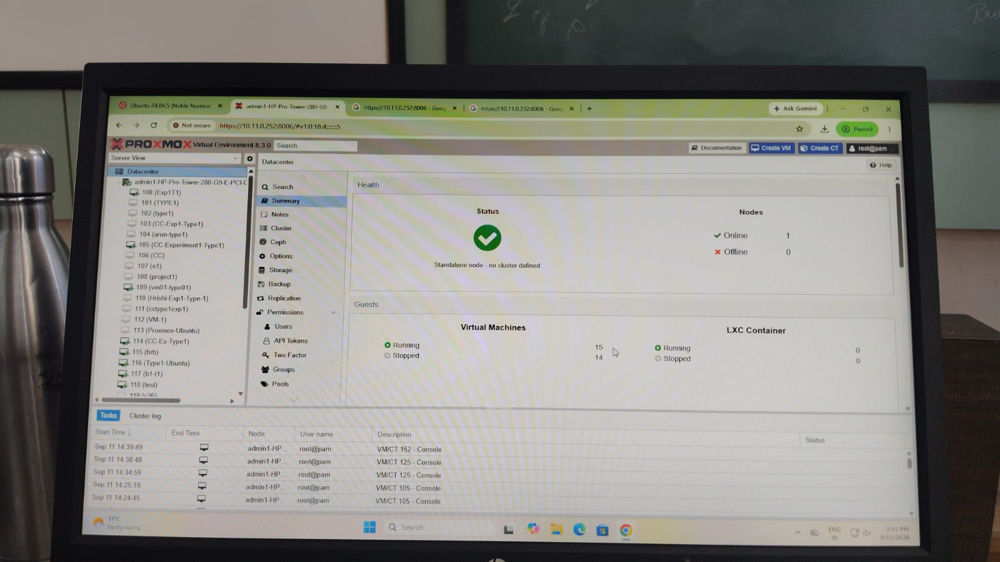
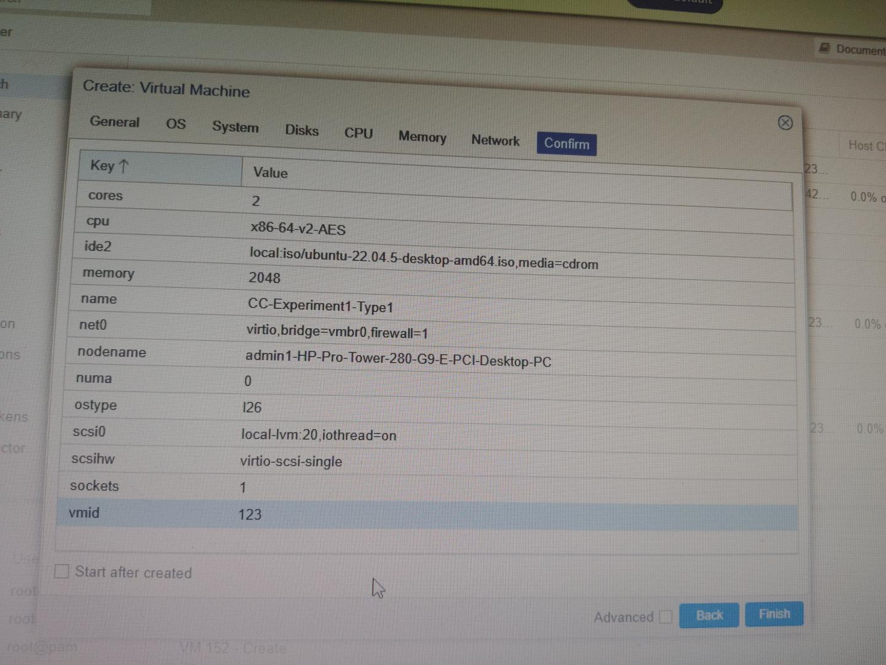
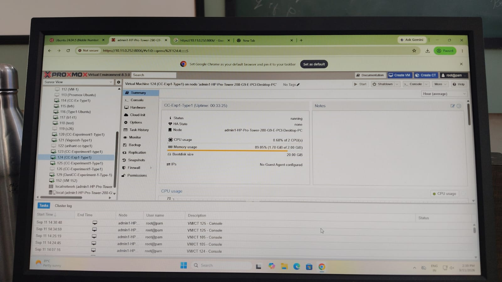
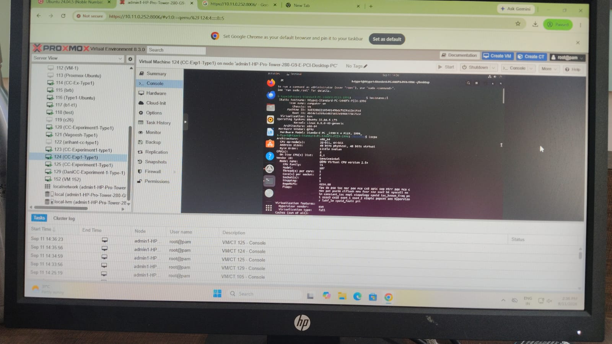
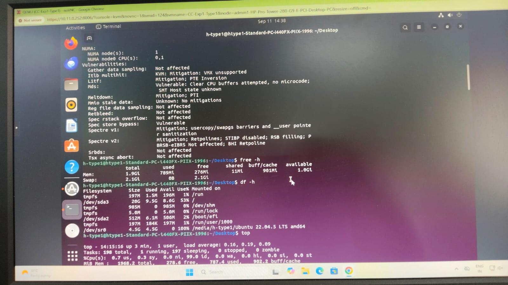
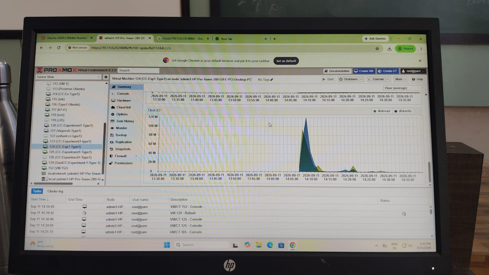
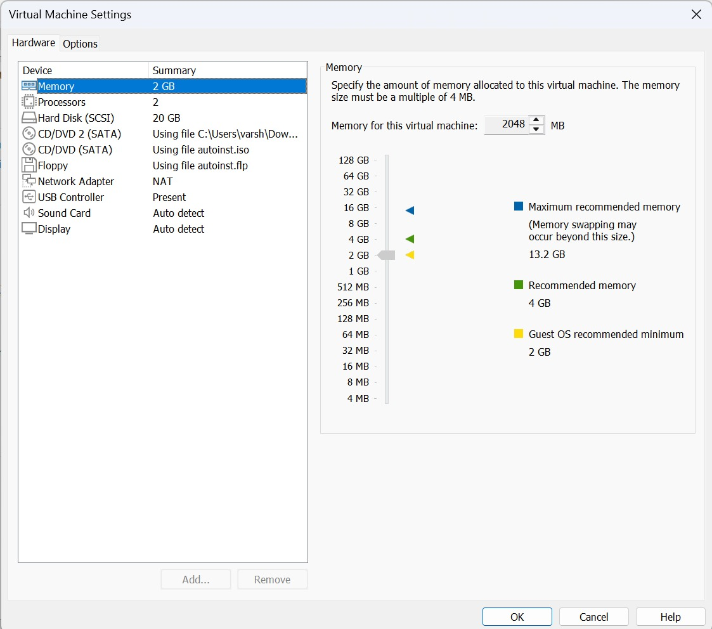
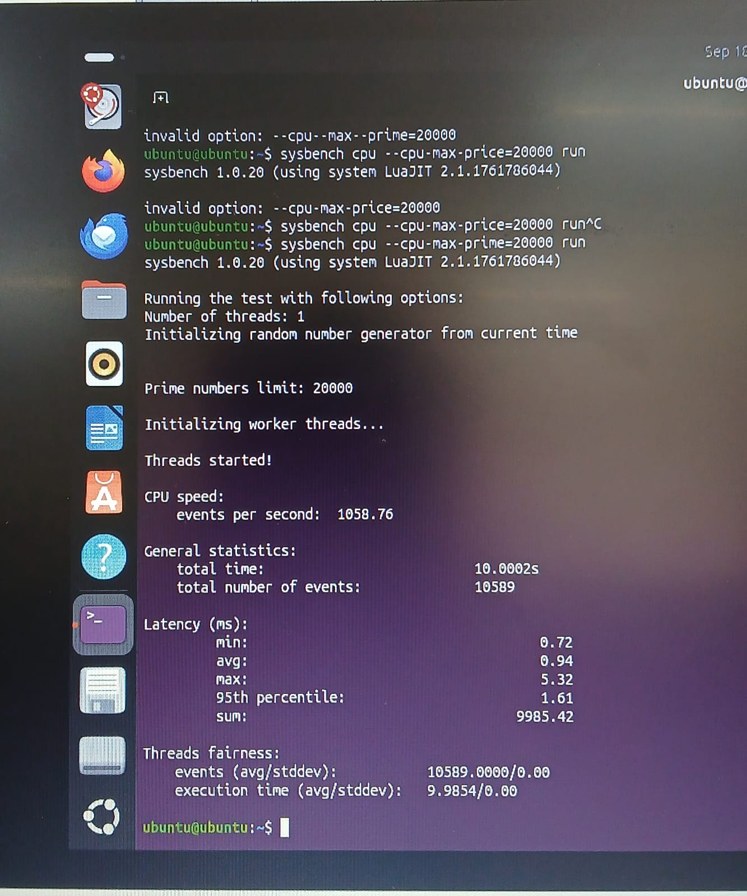

# CC Experiment 01 — Hypervisor Performance Analysis

## Performance Analysis of Type-1 and Type-2 Hypervisors

This experiment compares the CPU performance of a Type-1 hypervisor,
**Proxmox VE**, and a Type-2 hypervisor, **VMware Workstation**, using
identically configured Ubuntu virtual machines and the Sysbench CPU
benchmark.

### Key Finding

> **Proxmox VE (Type-1) achieved 1,689.43 events/sec compared to VMware
> Workstation's (Type-2) 1,058.76 events/sec — a +59.6% throughput
> advantage, with average latency 37.2% lower.**

---

## Table of Contents

1. [Objective](#1-objective)
2. [Hypervisors Used](#2-hypervisors-used)
3. [Virtual Machine Configuration](#3-virtual-machine-configuration)
4. [Type-1 Hypervisor — Proxmox VE](#4-type-1-hypervisor--proxmox-ve)
5. [Type-2 Hypervisor — VMware Workstation](#5-type-2-hypervisor--vmware-workstation)
6. [Performance Comparison](#6-performance-comparison)
7. [Analysis](#7-analysis)
8. [Conclusion](#8-conclusion)
9. [Repository Structure](#9-repository-structure)

---

## 1. Objective

- Configure a virtual machine on Proxmox VE (Type-1).
- Configure a virtual machine on VMware Workstation (Type-2).
- Use identical VM resources on both hypervisors.
- Run the same Sysbench CPU benchmark on each.
- Record and compare CPU performance results.

---

## 2. Hypervisors Used

| | Type-1 | Type-2 |
|---|---|---|
| Hypervisor | Proxmox VE | VMware Workstation |
| Architecture | Bare-metal (runs directly on hardware, KVM-based) | Hosted (runs as an application on top of a host OS) |

---

## 3. Virtual Machine Configuration

Both virtual machines were configured with identical resources to ensure a fair comparison.

| Resource | Type-1: Proxmox | Type-2: VMware |
|---|---|---|
| Guest OS | Ubuntu 22.04.5 LTS | Ubuntu (64-bit) |
| CPU | 2 vCPU (1 socket, 2 cores), x86-64-v2-AES | 2 vCPU (1 processor, 2 cores) |
| Memory | 2048 MiB | 2048 MB |
| Disk | 20 GB | 20 GB |
| Network | VirtIO, bridge `vmbr0` | NAT |
| Benchmark | Sysbench CPU 1.0.20 | Sysbench CPU 1.0.20 |
| Prime limit | 20000 | 20000 |

---

## 4. Type-1 Hypervisor — Proxmox VE

### 4.1 VM Configuration

- VM Name: `CC-Exp1-Type1`
- CPU: 2 vCPU, type `x86-64-v2-AES`
- Memory: 2048 MiB
- Disk: 20 GB (local-lvm)
- Network: VirtIO, bridge `vmbr0`
- Guest OS: Ubuntu 22.04.5 LTS
- Virtualization: KVM

### 4.2 Commands Used

```bash
hostnamectl
lscpu
free -h
df -h
top

sudo apt update
sudo apt install sysbench -y
sysbench --version
sysbench cpu --cpu-max-prime=20000 run
```

### 4.3 Sysbench CPU Benchmark Result

```
sysbench 1.0.20 (using system LuaJIT 2.1.0-beta3)

Running the test with following options:
Number of threads: 1
Prime numbers limit: 20000

CPU speed:
    events per second:  1689.43

General statistics:
    total time:                         10.0006s
    total number of events:             16903

Latency (ms):
         min:                                  0.57
         avg:                                  0.59
         max:                                  1.09
         95th percentile:                      0.68
         sum:                               9992.73

Threads fairness:
    events (avg/stddev):           16903.0000/0.00
    execution time (avg/stddev):   9.9927/0.00
```

### 4.4 Type-1 Observation Table

| Parameter | Observation |
|---|---|
| Hypervisor | Proxmox VE |
| Hypervisor Type | Type-1 |
| Guest OS | Ubuntu 22.04.5 LTS |
| CPU Allocation | 2 vCPU |
| Memory Allocation | 2 GB |
| Disk Allocation | 20 GB |
| Network | VirtIO / vmbr0 |
| Sysbench Version | 1.0.20 |
| CPU Prime Limit | 20000 |
| Total Execution Time | 10.0006 s |
| Total Events | 16903 |
| Events per Second | 1689.43 |
| Minimum Latency | 0.57 ms |
| Average Latency | 0.59 ms |
| Maximum Latency | 1.09 ms |
| 95th Percentile Latency | 0.68 ms |

### 4.5 Screenshots


*Figure 1: Proxmox VE dashboard after login.*


*Figure 2: VM creation — final configuration (Confirm page).*


*Figure 3: VM status showing Running, with CPU/memory usage.*


*Figure 4: Ubuntu running inside the Proxmox VE console.*


*Figure 5: `lscpu`, `free -h`, and `df -h` output inside the VM.*


*Figure 6: Sysbench CPU benchmark output — 1689.43 events/sec.*


*Figure 7: Proxmox VE resource monitoring (Disk I/O) graph.*

---

## 5. Type-2 Hypervisor — VMware Workstation

### 5.1 VM Configuration

- CPU: 2 vCPU (1 processor, 2 cores)
- Memory: 2048 MB
- Disk: 20 GB
- Guest OS: Ubuntu (64-bit)
- Network: NAT
- Host CPU: 12th Gen Intel Core i5-12450H

### 5.2 Commands Used

```bash
hostnamectl
lscpu
free -h
df -h
top

sudo apt update
sudo apt install sysbench -y
sysbench --version
sysbench cpu --cpu-max-prime=20000 run
```

**Note:** the benchmark command was initially entered incorrectly as
`sysbench cpu --cpu-max-price=20000 run`, producing an invalid option
error. The correct flag is `--cpu-max-prime=20000`.

### 5.3 Sysbench CPU Benchmark Result

```
sysbench 1.0.20 (using system LuaJIT 2.1.1761786044)

Running the test with following options:
Number of threads: 1
Prime numbers limit: 20000

CPU speed:
    events per second:  1058.76

General statistics:
    total time:                         10.0002s
    total number of events:             10589

Latency (ms):
         min:                                  0.72
         avg:                                  0.94
         max:                                  5.32
         95th percentile:                      1.61
         sum:                               9985.42

Threads fairness:
    events (avg/stddev):           10589.0000/0.00
    execution time (avg/stddev):   9.9854/0.00
```

### 5.4 Type-2 Observation Table

| Parameter | Observation |
|---|---|
| Hypervisor | VMware Workstation |
| Hypervisor Type | Type-2 |
| Guest OS | Ubuntu (64-bit) |
| CPU Allocation | 2 vCPU |
| Memory Allocation | 2 GB |
| Disk Allocation | 20 GB |
| Network | NAT |
| Sysbench Version | 1.0.20 |
| CPU Prime Limit | 20000 |
| Total Execution Time | 10.0002 s |
| Total Events | 10589 |
| Events per Second | 1058.76 |
| Minimum Latency | 0.72 ms |
| Average Latency | 0.94 ms |
| Maximum Latency | 5.32 ms |
| 95th Percentile Latency | 1.61 ms |

### 5.5 Screenshots


*Figure 8: VMware Workstation hardware settings — 2 GB RAM, 2 vCPU, 20 GB disk, NAT.*


*Figure 9: Ubuntu desktop running inside VMware Workstation.*


*Figure 10: `lscpu`, `free -h`, `df -h` output inside the VM.*


*Figure 11: Sysbench CPU benchmark output — 1058.76 events/sec.*

---

## 6. Performance Comparison

| Performance Metric | Proxmox VE (Type-1) | VMware Workstation (Type-2) | Difference | Advantage |
|---|---|---|---|---|
| Total Execution Time | 10.0006 s | 10.0002 s | ~0.004% | Fixed 10s window |
| Total Events Processed | **16,903** | 10,589 | +6,314 (+59.6%) | Proxmox VE |
| Events per Second (EPS) | **1,689.43** | 1,058.76 | +630.67 (+59.6%) | Proxmox VE |
| Minimum Latency | **0.57 ms** | 0.72 ms | −0.15 ms (−20.8%) | Proxmox VE |
| Average Latency | **0.59 ms** | 0.94 ms | −0.35 ms (−37.2%) | Proxmox VE |
| 95th Percentile Latency | **0.68 ms** | 1.61 ms | −0.93 ms (−57.8%) | Proxmox VE |
| Maximum Latency | **1.09 ms** | 5.32 ms | −4.23 ms (−79.5%) | Proxmox VE |


*Figure 12: CPU throughput and latency comparison — Proxmox VE (Type-1) vs VMware Workstation (Type-2).*

---

## 7. Analysis

Proxmox VE (Type-1) outperformed VMware Workstation (Type-2) across
every measured metric, with the gap most visible in maximum latency
(79.5% lower) and 95th percentile latency (57.8% lower).

- **Architectural overhead**: Proxmox VE's KVM hypervisor runs directly
  on bare metal, so guest CPU instructions execute close to hardware
  with minimal interception. VMware Workstation runs as an application
  on top of a host OS, adding an extra translation and scheduling layer
  between the guest and the physical CPU.
- **Scheduling contention**: on VMware, the guest competes with the
  host OS's own background processes for CPU time, which likely
  explains the higher and more variable latency (max 5.32 ms vs
  1.09 ms).
- **Consistency**: Proxmox VE's tighter spread between min (0.57 ms)
  and max (1.09 ms) latency indicates more predictable performance —
  useful for latency-sensitive workloads.

---

## 8. Conclusion

This experiment measured CPU performance of identically configured
Ubuntu VMs (2 vCPU, 2 GB RAM, 20 GB disk) on a Type-1 hypervisor
(Proxmox VE) and a Type-2 hypervisor (VMware Workstation), using the
Sysbench CPU benchmark with a prime limit of 20000.

Proxmox VE delivered **59.6% higher throughput** and **37.2% lower
average latency** than VMware Workstation, consistent with the
architectural expectation that bare-metal (Type-1) hypervisors
introduce less overhead than hosted (Type-2) hypervisors for
CPU-bound workloads.

**Use-case takeaway:**
- **Type-1 (Proxmox VE)** — better suited for production, servers, and
  performance-critical workloads.
- **Type-2 (VMware Workstation)** — convenient for local development,
  testing, and desktop sandboxing where raw performance matters less.

---

## 9. Repository Structure

```
CC-Experiment-01-Hypervisor-Analysis/
│
├── README.md
│
├── screenshots/
│   ├── type1-proxmox/
│   │   ├── 01-proxmox-dashboard.png
│   │   ├── 02-proxmox-vm-configuration.png
│   │   ├── 03-proxmox-vm-running.jpeg
│   │   ├── 04-proxmox-ubuntu-console.jpeg
│   │   ├── 05-proxmox-system-configuration.jpeg
│   │   ├── 06-proxmox-sysbench-result.jpeg
│   │   └── 07-proxmox-resource-monitoring.jpeg
│   │
│   ├── type2-vmware/
│   │   ├── 01-vmware-vm-configuration.jpeg
│   │   ├── 02-vmware-vm-running.jpeg
│   │   ├── 03-vmware-system-configuration.jpeg
│   │   └── 04-vmware-sysbench-result.jpeg
│   │
│   └── comparison/
│       └── 01-hypervisor-performance-comparison.png
│
└── results/
    └── performance-analysis.md
```

### VM Shutdown

```bash
sudo poweroff
```

For VMware Workstation, alternatively: `VM → Power → Shut Down Guest`
